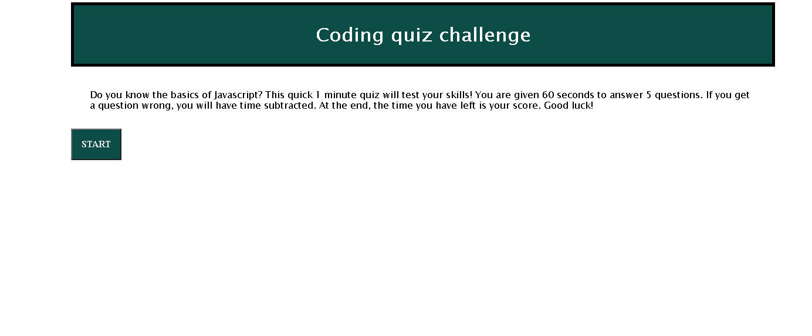

# Quiz-game

## Description
I made a quiz game that asks basic JavaScrpit questions. As a homework assignment for my class, we made a timed quiz that keeps track of your score as the timer. Getting a question wrong subtracts from the timer. Working on this, I learned how to 'loop' through functions using events and index numbers to grab the next question. I also learned how to set an effective timer. Additionally, working on this made me more familiar with traversing the DOM and using different selectors, appending things, and styling things using JavaScript by using the setAttribute method. 

## Installation
What are the steps required to install your project? Provide a step-by-step description of how to get the development environment running.
## Usage
Read the description before you start. Again, you have one minute for 5 questions so it could go by quickly. Click start and then after you answer a question, you will be taken to the next question. The timer is on the top left. 
    
     
     
   
